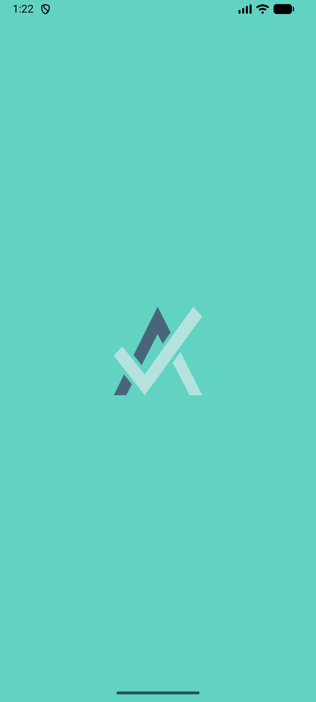
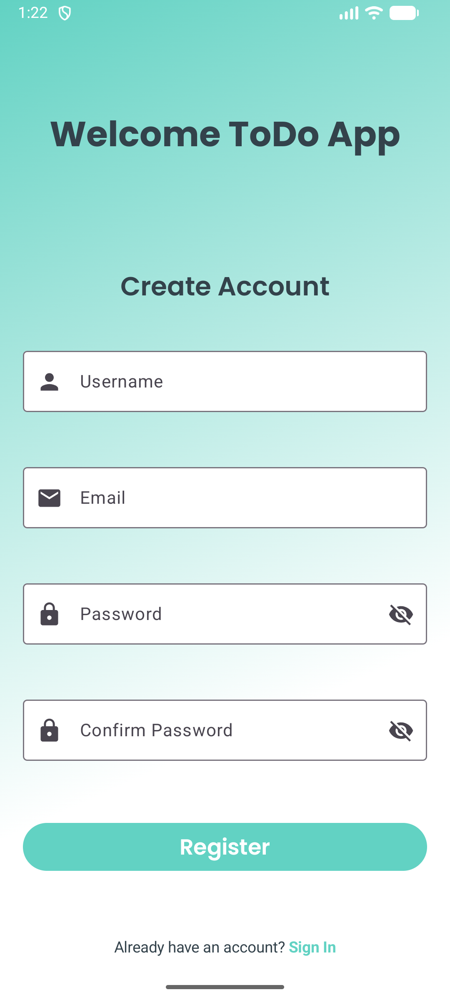
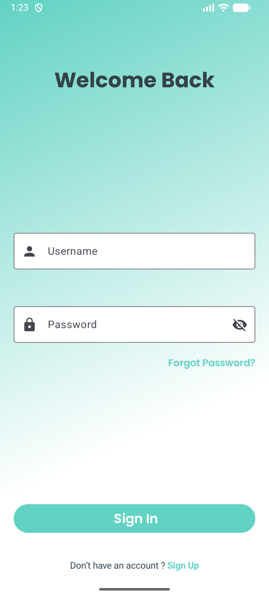
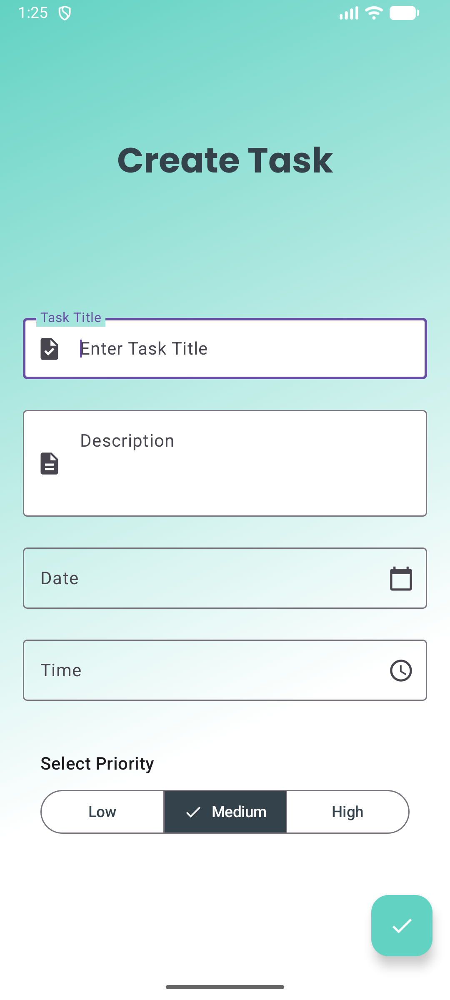
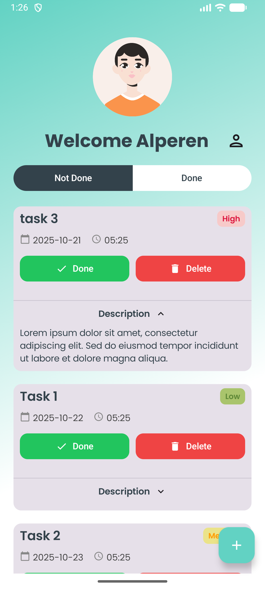

# To Do App

This is a modern to-do list application developed using Kotlin and Jetpack Compose. It offers users an easy way to manage their tasks and features a stylish design with the Poppins font.

## ✨ Features

- **User Login:** Secure user authentication system.
- **Task Management:** Add new tasks, edit existing ones, and delete them.
- **Modern UI:** A clean, simple, and reactive user interface built with Jetpack Compose.
- **Data Persistence:** Stores tasks locally using Room and user preferences with DataStore.

## 🛠️ Technologies Used

- **Language:** [Kotlin](https://kotlinlang.org/)
- **UI & Foundation:**
    - [Jetpack Compose](https://developer.android.com/jetpack/compose): A modern declarative UI toolkit for Android.
    - [Material 3](https://m3.material.io/): The latest version of Google's open-source design system.
    - [Compose Navigation](https://developer.android.com/jetpack/compose/navigation): For navigating between screens in Compose.
    - [Core Splashscreen](https://developer.android.com/develop/ui/views/launch/splash-screen): For a seamless app launch experience.
    - [Android KTX](https://developer.android.com/kotlin/ktx): Kotlin extensions for a more idiomatic API.
- **Architecture & Lifecycle:**
    - MVVM (Model-View-ViewModel)
    - [Lifecycle (ViewModel & Runtime)](https://developer.android.com/jetpack/androidx/releases/lifecycle): For managing UI-related data in a lifecycle-conscious way.
- **Asynchronous Programming:**
    - [Coroutines & Flow](https://kotlinlang.org/docs/coroutines-guide.html)
- **Data Persistence:**
    - [Room](https://developer.android.com/training/data-storage/room): For local database storage.
    - [DataStore Preferences](https://developer.android.com/topic/libraries/architecture/datastore): For storing key-value pairs.
- **Dependency Injection:**
    - [Hilt](https://developer.android.com/training/dependency-injection/hilt-android): A dependency injection library for Android.
- **Static Code Analysis:**
    - [Detekt](https://detekt.dev/): To improve code quality.

## 📸 Screenshots

  
  &nbsp; &nbsp; &nbsp;
  
&nbsp; &nbsp; &nbsp;
  
&nbsp; &nbsp; &nbsp;
  
&nbsp; &nbsp; &nbsp;
  

